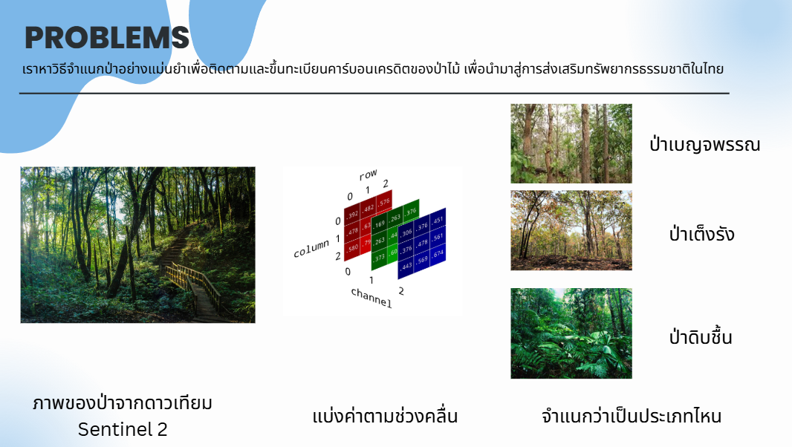

# About
- This is one of my work in Hackatron of SuperAI Engineer ss4 
- The goal is to classify forest type from Satellite Data.
- The Data have 3 forest types with the image from Satellite called Sentinel-2

## method
1. I to tried to use LLM as a forest specialist to come up with useful features for developing ML models
2. Use vaious ML models and Ensemble to create a powerful models including
   - Deeplearning
   - Xgboost
   - Lightboost
   - Catboost
   

